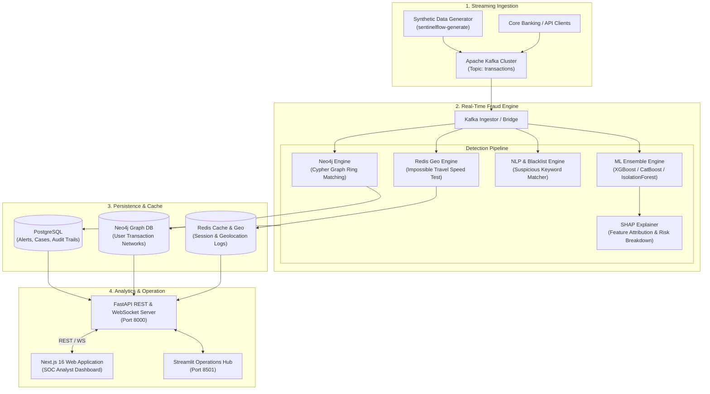

# SentinelFlow 🛡️⚡

<div align="center">


**Real-Time Enterprise Financial Fraud Detection & Anti-Money Laundering (AML) Platform**

[](https://python.org)
[](https://fastapi.tiangolo.com)
[](https://nextjs.org)
[](https://kafka.apache.org)
[](https://neo4j.com)
[](https://redis.io)
[](https://www.docker.com)
[](https://docs.pytest.org)
[](https://github.com/psf/black)
[](LICENSE)

[Architecture](#-architecture) • [Features](#-key-features) • [Detection Engines](#-fraud-detection-engines) • [Tech Stack](#-technology-stack) • [Quick Start](#-quick-start) • [API Reference](#-api-reference) • [Documentation](#-project-structure)

</div>

---

## 📋 Overview

**SentinelFlow** is a next-generation, high-throughput, cloud-native financial intelligence and fraud detection engine. Engineered for commercial banks, fintech platforms, and payment providers, SentinelFlow analyzes streaming financial transactions with **sub-100ms latency** to neutralize multi-layer fraud vectors including:

- 🔄 **Money Laundering Rings (AML)**: Circular fund flow detection ($A \rightarrow B \rightarrow C \rightarrow A$) using graph algorithms.
- ✈️ **Impossible Travel Anomalies**: Geo-spatial velocity validation across consecutive card/transfer events via Redis Geo.
- 🤖 **AI/ML Anomaly Scoring**: Multi-model ensembles (XGBoost, LightGBM, CatBoost, AutoEncoder, Isolation Forest) with SHAP explainability.
- 📋 **KYC & Sanctions Compliance**: Real-time screening against PEP (Politically Exposed Persons), international sanction lists, and MASAK regulatory rules.
- 🕸️ **Graph Neural Networks & Federated Learning**: Advanced graph embedding models and privacy-preserving multi-institutional model aggregation via Flower.

---

## 🏗️ Architecture



---

## ✨ Key Features

### 🚀 Performance & Scalability
- **Sub-100ms End-to-End Latency**: Optimized pipeline executing graph traversal, spatial math, regex filters, and ML inference concurrently.
- **High-Throughput Streaming**: Handles 10,000+ transactions/sec powered by Apache Kafka partitioning.
- **Asynchronous Architecture**: Fully async Python stack utilizing FastAPI, asyncpg, and Redis asyncio.

### 🛡️ Multi-Layer Security & AML Compliance
- **PEP & Sanctions Screening**: Automatic match verification against sanctions datasets (OFAC, EU, UN).
- **MASAK & Regulatory Audit Logging**: Immutable compliance audit records with configurable retention.
- **Role-Based Access Control (RBAC)**: Fine-grained JWT authentication (`admin`, `analyst`, `auditor`).

### 📊 Explainable AI & MLOps
- **SHAP Feature Explanations**: Provides analysts with exact feature contributions for every flagged fraud score.
- **Federated Learning (Flower)**: Train shared fraud detection models across multiple banking nodes without exposing sensitive customer data.
- **Automated Model Retraining**: CI/CD integration with automated baseline comparison, hyperparameter optimization, and artifact tracking.

---

## 🔍 Fraud Detection Engines

| Engine | Technology | Detection Strategy | Severity |
| :--- | :--- | :--- | :--- |
| **Circular Money Ring** | Neo4j Graph DB | Scans transaction topology for directed cyclic paths ($N$-hop loops) within 7-day windows. | 🔴 **CRITICAL** |
| **Impossible Travel** | Redis GeoSpatial | Computes geographical distance & velocity between sequential card/transfer events. Flags $>900\text{ km/h}$. | 🟠 **HIGH** |
| **NLP & Blacklist** | Regex / Keyword | Scans transaction descriptions against categorized dictionaries (Gambling, Crypto, Anonymizers, Urgency). | 🟡 **MEDIUM - CRITICAL** |
| **Ensemble ML Anomaly** | XGBoost + CatBoost + LightGBM + Isolation Forest | Combines supervised gradient boosting and unsupervised isolation scores with dynamic thresholding. | 🟠 **HIGH** |
| **Graph Neural Network (GNN)** | PyTorch Geometric / DGL | Evaluates structural risk scores based on graph node embeddings and transaction neighborhood topologies. | 🟠 **HIGH** |

---

## 💻 Technology Stack

### Backend & Core Logic
- **Language**: Python 3.9+ / 3.10+
- **API Framework**: FastAPI, Pydantic v2, Uvicorn
- **ORM & Database**: SQLAlchemy 2.0 (Async), Alembic, PostgreSQL 16
- **Cache & Key-Value**: Redis 7.2

### Machine Learning & Data Science
- **Core ML**: scikit-learn, XGBoost, LightGBM, CatBoost
- **Deep Learning & Graph**: PyTorch, PyTorch Geometric, AutoEncoder models
- **Explainability**: SHAP (SHapley Additive exPlanations)
- **Federated Learning**: Flower (Flwr)

### Streaming & Graph Storage
- **Message Broker**: Apache Kafka 7.5.0 + Zookeeper
- **Graph Database**: Neo4j 5.15 Enterprise/Community (Cypher Query Language)

### Frontend & Dashboards
- **Web App**: Next.js 16 (App Router), React 19, TypeScript, Tailwind CSS, Lucide Icons
- **SOC Analyst Hub**: Streamlit 1.30+

---

## ⚡ Quick Start

### Prerequisites
- [Docker & Docker Compose v2.0+](https://docs.docker.com/get-docker/)
- [Python 3.9+](https://www.python.org/downloads/)
- [Node.js 18+](https://nodejs.org/) *(for web dashboard)*

---

### 1. Clone & Set Up Environment

```bash
git clone https://github.com/YusuffEren/sentinelflow.git
cd sentinelflow

# Copy environment configuration
cp .env.example .env
```

---

### 2. Launch Infrastructure Services (Docker)

```bash
docker-compose up -d
```

Verify running containers:
```bash
docker-compose ps
```

| Service | Host Port | Description |
| :--- | :--- | :--- |
| **FastAPI Backend** | `8000` | REST API, WebSockets, OpenAPI docs (`/docs`) |
| **Streamlit Dashboard** | `8501` | SOC Analyst Monitoring Interface |
| **Next.js Web Portal** | `3000` | Modern Frontend Application |
| **Kafka Broker** | `9092` | Event Streaming Bus |
| **Kafka UI** | `8080` | Web UI for Topic & Message Inspection |
| **Neo4j Graph DB** | `7474` (HTTP), `7687` (Bolt) | Graph Database Browser |
| **Redis Server** | `6379` | GeoSpatial Indexing & Caching |
| **Redis Commander** | `8081` | Web UI for Redis Key Exploration |

---

### 3. Install Dependencies & Run Database Migrations

```bash
# Create and activate virtual environment
python -m venv .venv
# On Windows:
.venv\Scripts\activate
# On Linux/macOS:
source .venv/bin/activate

# Install package in editable mode with development dependencies
pip install -e ".[dev]"

# Run database migrations
alembic upgrade head

# Seed initial admin user
python scripts/seed_admin.py
```

---

### 4. Run the Platform Services

#### A. Synthetic Transaction Generator
Generate live streaming financial transactions with custom fraud ratios:
```bash
sentinelflow-generate --batch-size 50 --delay 0.5 --fraud-ratio 0.1
```

#### B. Real-Time Fraud Detector Service
```bash
python -m sentinelflow.processor.detector
```

#### C. FastAPI REST & WebSocket Server
```bash
uvicorn sentinelflow.api.app:app --host 0.0.0.0 --port 8000 --reload
```

#### D. Streamlit Operations Dashboard
```bash
streamlit run src/sentinelflow/dashboard/app.py
```

---

## 📡 API Reference

Interactive API Swagger documentation is available at `http://localhost:8000/docs`.

### Primary Endpoints

| Method | Endpoint | Description | Auth Required |
| :--- | :--- | :--- | :--- |
| `POST` | `/api/v1/auth/login` | Authenticate user & receive JWT access token | ❌ |
| `GET` | `/api/v1/alerts` | List detected fraud alerts with filtering options | 🔒 |
| `GET` | `/api/v1/alerts/{alert_id}` | Retrieve detailed alert information with SHAP explanation | 🔒 |
| `POST` | `/api/v1/cases` | Create a new fraud investigation case | 🔒 |
| `GET` | `/api/v1/graph/circular` | Query graph database for money laundering rings | 🔒 |
| `POST` | `/api/v1/kyc/screen` | Perform PEP & Sanctions screening on a customer | 🔒 |
| `GET` | `/metrics` | Prometheus operational & detection metrics | ❌ |

---

## 🧪 Testing & Quality Assurance

SentinelFlow includes a comprehensive automated test suite with **111+ unit, integration, and ML validation tests**.

```bash
# Run complete test suite with coverage
pytest --cov=src/sentinelflow --cov-report=term-missing

# Run specific test suites
pytest tests/test_api.py        # API Endpoints
pytest tests/test_ml_models.py  # ML Engine & Ensembles
pytest tests/test_compliance.py # KYC & MASAK Audit
pytest tests/test_federated.py  # Federated Learning
```

### Code Quality Tools
```bash
# Format code with Black
black src/ tests/

# Lint with Ruff
ruff check src/ tests/

# Type check with MyPy
mypy src/
```

---

## 📂 Project Structure

```
sentinelflow/
├── .github/workflows/         # CI/CD & Automated ML Pipeline
├── alembic/                   # PostgreSQL Database Migration Scripts
├── data/                      # Sample Datasets & Benchmark Files
├── docker-compose.yml         # Container Infrastructure Configuration
├── Dockerfile                 # SentinelFlow Microservice Container Image
├── models/                    # Serialized Machine Learning Models
├── pyproject.toml             # Project Metadata & Python Dependencies
├── README.md                  # Project Documentation
├── scripts/                   # Utility, Training & Seeding Scripts
│   ├── seed_admin.py          # Admin User Initializer
│   ├── train_competition.py   # Multi-Model ML Training Pipeline
│   └── init_neo4j_schema.cypher # Neo4j Graph Schema Initialization
│
├── sentinelflow-web/          # Next.js 16 Frontend Web Application
│   ├── src/app/               # App Router Pages (Dashboard, Alerts, Login)
│   ├── src/components/        # UI Components & Interactive Charts
│   └── package.json           # Frontend Dependencies
│
├── src/sentinelflow/          # Core Python Source Package
│   ├── api/                   # FastAPI Backend Application & Routes
│   ├── auth/                  # JWT Authentication & Password Utilities
│   ├── compliance/            # MASAK Audit Logging & Compliance Logic
│   ├── config/                # Pydantic Settings & Environment Loaders
│   ├── contracts/             # Pydantic Schemas & Data Contracts
│   ├── database/              # PostgreSQL Connection & ORM Models
│   ├── generator/             # Transaction Generator Engine
│   ├── ingestor/              # Kafka Ingestion & Event Bridge
│   ├── kyc/                   # PEP & Sanctions Screening Engine
│   ├── ml/                    # Machine Learning, GNN, SHAP & Federated Learning
│   ├── monitoring/            # OpenTelemetry & Prometheus Metrics
│   ├── processor/             # Main Fraud Detector Engine (Neo4j, Redis, ML)
│   └── dashboard/             # Streamlit Analyst Dashboard
│
└── tests/                     # Test Suite (111 Tests)
```

---

## ⚙️ Environment Configuration

Key configuration parameters (set in `.env`):

| Variable | Description | Default |
| :--- | :--- | :--- |
| `POSTGRES_SERVER` | PostgreSQL host | `localhost` |
| `POSTGRES_DB` | Database name | `sentinelflow` |
| `KAFKA_BOOTSTRAP_SERVERS` | Kafka cluster address | `localhost:9092` |
| `KAFKA_TOPIC_TRANSACTIONS` | Streaming transaction topic | `transactions` |
| `KAFKA_TOPIC_ALERTS` | Generated alert topic | `alerts` |
| `NEO4J_URI` | Neo4j Bolt URL | `bolt://localhost:7687` |
| `NEO4J_USER` | Neo4j database user | `neo4j` |
| `REDIS_HOST` | Redis cache host | `localhost` |
| `IMPOSSIBLE_TRAVEL_MAX_SPEED_KMH` | Max travel speed threshold ($km/h$) | `900` |
| `CIRCULAR_TRANSACTION_MIN_DEPTH` | Minimum money ring cycle length | `3` |
| `JWT_SECRET_KEY` | Secret key for auth tokens | *Configurable* |

---

## 📜 License

This project is licensed under the **MIT License**. See the [LICENSE](LICENSE) file for details.

---

<div align="center">

Made with ❤️ by **[Yusuf Eren Bozkurt](https://github.com/YusuffEren)**

*SentinelFlow — Safeguarding Financial Systems with Real-Time Intelligence.*

</div>
